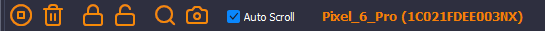

# Device Lens Documentation

## Toolbar

The toolbar provides convenient buttons for operating device lens:

The operations for the buttons are described in the [Basic Operations](#basic-operations) section.

When the `Auto Scroll` checkbox is checked, the log output automatically scrolls the output down to the most recent entry. Unchecking the checkbox stops the output from automatically scrolling.

The model and serial of the selected device is displayed to the right of the Auto Scroll checkbox, when log monitoring is active.

## Toolbar functions

Play&nbsp;&nbsp;&nbsp;&nbsp;&nbsp;&nbsp;&nbsp;Clear Log&nbsp;&nbsp;Doze On&nbsp;&nbsp;&nbsp;Doze Off&nbsp;&nbsp;&nbsp;&nbsp;Explorer&nbsp;&nbsp;Screenshot

### Play

Click the `Play` button to start monitoring the output for all processes, if monitoring is not already started.

### Clear log

Click the `Clear Log` button to clear all log entries from the log output in Device Lens (i.e it does not clear the actual logs on the device)

### Doze On/Off

This feature may be used the least of all, however it serves a fairly useful function, especially when it comes to testing applications that need to do something when the device is in "doze" mode. Normally the device goes into this mode only after an extended period of time, after the display turns off, all while the device is not connected to power. With this function, you can simulate "doze" mode even while the display is still on!

The reason why there are 2 buttons: there appears to be no way to monitor when the device comes out of doze mode, so using the "Doze Off" button guarantees (hopefully) that the device has exited "doze" mode.

There are ways to determine via _code_ whether or not the device is in "doze" mode, such as [in the Kastri library](https://github.com/DelphiWorlds/Kastri/blob/54f826a78c365449d9b930065ccf9487da77768c/Core/DW.Background.Android.pas#L194). In your code [you can monitor for this change](https://github.com/DelphiWorlds/Kastri/blob/54f826a78c365449d9b930065ccf9487da77768c/Core/DW.Background.Android.pas#L39) and use log statements, so that you can see when the device enters/exits "doze" mode.

### Device Explorer

Click the `Device Explorer` button to bring up the Device Explorer:

Select a device from the connected devices list, and Device Lens will populate the Packages list.

The Package Filter edit filters the Packages list to match the text anywhere in the package name, and is case-insensitive.

Selecting a package and clicking the `Dump` button will dump information about the package in the Package Dump edit.

Selecting a package and clicking the `Download` button will download the APK associated with the package to the folder selected, when prompted.

Checking the checkbox next to packages allows you `Uninstall` the packages that have their checkbox checked.

### Screenshot

Clicking the `Screenshot` button brings up a window while Device Lens is sending a command to the device to take a screenshot if/when it returns a result (it can be problematic on some devices), the image is displayed in the window:

In the screenshot window, click the `Copy` button to copy the image to the clipboard, and click the `Re-capture` button to take a new capture of the device screen

## Log output

When device log monitoring starts, Device Lens shows the log output in the area below the toolbar.
Different log levels of the output log are colored according to the settings in the [Filters](#filters). The output is selectable using the mouse, and the output can be copied to the clipboard using `Ctrl-C`. Right-clicking the output brings up a popup menu which has an option to save the output to a text file:

## Filters

### Filter On Text

Filters on text contained in the `Text` column of the log output

### Filter On Tag

Filters on text contained in the `Tag` column of the log output

### Filter On Application

Filters on text contained in the `Application` column of the log output. This filter is automatically populated when double-clicking on an application name in the Process List.

The above 3 filters are **case sensitive**, the filter value can appear **anywhere** in the text being filtered, and the filtering for these is applied once the user has stopped typing. 

### Filter By Log Level

Filters log messages based on the `Level` column of the log output. Using the `Toggle` button will check/uncheck all levels at once. This filter is applied immediately after a change. The color of the entire line of log output for a particular log level can be controlled using the color edits for each log level.

## Connected Devices List

This shows the devices connected to the machine where debugging via ADB is available.

Once a device is selected, the toolbar buttons should enable.

## Processes List

Shows the currently running processes on the selected device. Device Lens filters out processes that are suspected to be system processes, which you would be unlikely to want to monitor the log output for.

Double-clicking a process in the Process List will start monitoring the log output for the device, and automatically populate the Filter On Application value.

## Changing Themes

The theme selector allows you to choose between a number of different themes supported by Device Lens. Drop down the combo and select the theme of your choice. 

You may need to change the [colors for log levels](#filter-by-log-level) after selecting a new theme.

