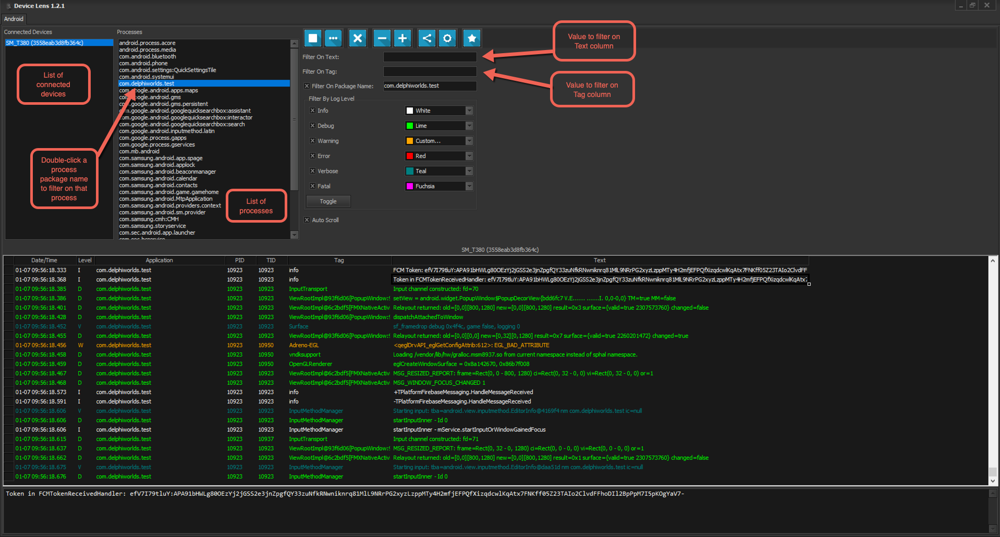

# Device Lens
Device Lens is a debugging tool that allows you to view logs on your mobile devices (presently **Android only**). This repository is currently just for basic help, the installers and for reporting issues

## Change history:

v1.2.1 (June 3rd, 2020)

* Fixed issue with filtering on Text and Tag

v1.2.0 (May 9th, 2020)

* Added SDK Installer function
* Added Configure device for TCP/IP mode function 
* Added filtering on Tag value (issue #5)
* Added memo below the grid to display the "text" portion of the selected row (issue #4)
* Fixed issue #6 - disable Explorer view function when no devices selected 

v1.1.0 (January 2nd, 2020)

* Added Device Explorer
* Added simulation of "doze" mode
* Fixed auto search/config for location of SDK, adb executable etc so that Device Lens can run on a machine without Delphi installed

v1.0.1 (October 3rd, 2019)

* Fixed parsing of process list for (at least) Symbol TC70 and Lenovo Tab 3 devices

v1.0.0 (September 30th, 2019)

* Initial release

## Help

### Requirements

Device Lens requires the Android SDK Tools to be installed, as it uses the adb command to capture the device logs etc. It does not require any Build-tools or Android Platforms to be installed: just the Tools.

When Device Lens starts, it checks whether or not Delphi is installed, and if so, will use the configured Android SDK Tools. If not, Device Lens will prompt for a folder where the Android SDK Tools are installed, or if they are not installed, you can choose to start the Android SDK Installer. The installer allows you to also install Build-tools and Platforms however **these are not required for Device Lens** 

### Device Lens functionality

#### Device Lens main window

Device Lens lists the connected devices in the list on the top left. Selecting a device will show what processes are running on the device. Double clicking a process name will start the log display and filter on that process.

#### Device Lens toolbar

Clicking the **Play** button in the toolbar will start displaying the logs coming from the device. The Play button will turn into a **Stop** button once the log display starts.

You can filter on text that appears in the log display by typing in the Filter On Text edit. This filter supports basic wildcards by using an asterisk at the beginning or end of the filter.

You can manually enter a process name (package name) in the Filter On Package Name edit. Press enter once you have finished typing to enable the filter

You can use the Filter By Log Level checkboxes to filter messages based on their log level. The Toggle button changes all the checkboxes to the opposite of the most prevalent state of the checkboxes.

The Auto Scroll checkbox controls whether the log display scrolls automatically to the last entry

